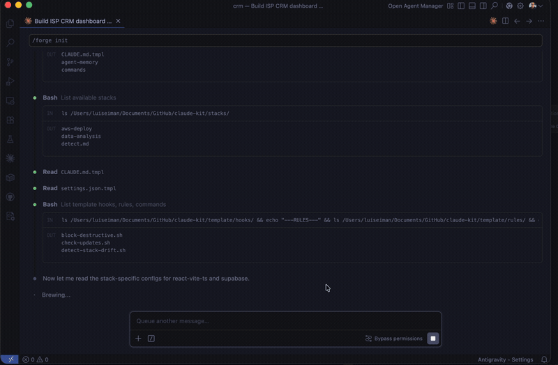
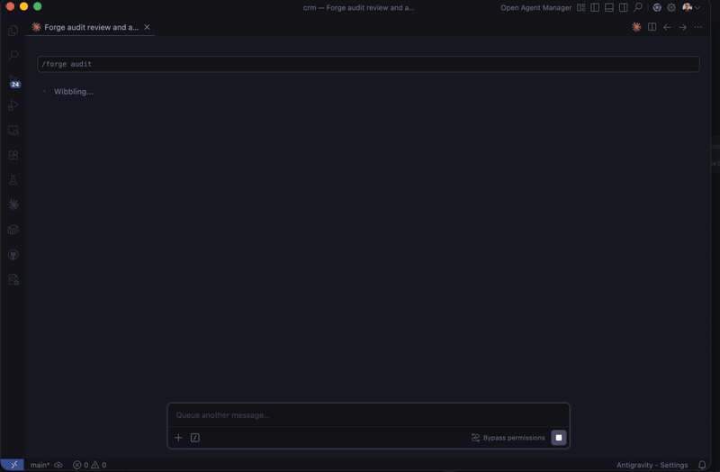
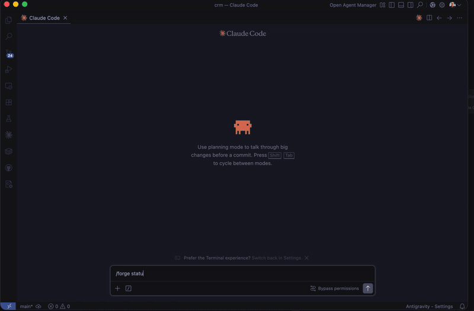

> **[English](#dotforge)** | **[Español](#dotforge-español)**

# dotforge

[](https://github.com/luiseiman/dotforge/stargazers)
[](LICENSE)
[](VERSION)
[](https://github.com/luiseiman/dotforge/commits/main)

Configuration governance for [Claude Code](https://docs.anthropic.com/en/docs/claude-code). Bootstrap, audit, sync, and evolve your `.claude/` configuration across projects — all markdown + shell scripts, zero required dependencies.

```
bootstrap → audit → sync → capture → propagate
    ↑                                    │
    └────────────────────────────────────┘
```

For people and teams managing more than one Claude Code project.

Use dotforge if:

- your `.claude/` configuration drifts across repos
- you want to audit configuration quality, not just generate files once
- you want to propagate improvements discovered in one project to others
- you want a repeatable system, not a loose collection of prompts

Do not use dotforge if:

- you only have one small repo
- you only want a `CLAUDE.md` generator
- you do not care about sync, audit history, or cross-project consistency

## Quick Start

```bash
# One-liner install
curl -fsSL https://raw.githubusercontent.com/luiseiman/dotforge/main/install.sh | bash

# Or manual:
git clone https://github.com/luiseiman/dotforge.git ~/.dotforge
export DOTFORGE_DIR="$HOME/.dotforge"
$DOTFORGE_DIR/global/sync.sh

# In any project directory:
/forge init         # Zero to config in one command
/forge audit        # Score your configuration (0-10)
/forge sync         # Update against current template
```

### Requirements

bash (macOS, Linux, WSL). Git Bash works but WSL recommended on Windows. Optional: `python3`, `jq` for full hook support.

### Works with

dotforge manages your `.claude/` configuration. It complements, not replaces, other tools:

| Tool | What it does | How dotforge helps |
|------|-------------|-------------------|
| [claude-skills](https://github.com/alirezarezvani/claude-skills) | 248+ skills collection | dotforge manages the config around your skills |
| [gstack](https://github.com/garrytan/gstack) | AI-native full-stack framework | dotforge audits and syncs the `.claude/` config gstack generates |
| [duthaho/claudekit](https://github.com/duthaho/claudekit) | Behavioral modes | dotforge adds lifecycle management: audit, sync, practices, registry |

> **New here?** Read the **[Usage Guide](docs/usage-guide.md)** for a complete walkthrough with examples.

## See it in action

### `/forge init` — Zero to config in one command



### `/forge audit` — Score your project's configuration



### `/forge bootstrap` — Full interactive setup


### `/forge status` — Multi-project registry dashboard



## Why dotforge

### What makes it different

1. **Cross-project registry with audit history** — track scores across all your projects, spot regressions, compare configurations over time
2. **Practices pipeline** — continuous improvement lifecycle: `inbox/ → evaluating/ → active/ → deprecated/`. Discoveries propagate across projects
3. **Template sync with customization preservation** — `<!-- forge:section -->` markers let `/forge sync` update managed sections without touching your customizations
4. **Audit scoring with security cap** — 12-item checklist normalized to 10 points. Missing security essentials caps score at 6.0 regardless of other items

Other tools bootstrap once. dotforge bootstraps, audits, syncs, and evolves.

### Multi-platform export

```
/forge export cursor     → .cursorrules
/forge export codex      → AGENTS.md
/forge export windsurf   → .windsurfrules
/forge export openclaw   → SKILL.md
```

## What it does

`/forge bootstrap` detects your project's tech stack and generates:

- **CLAUDE.md** — project instructions with build/test commands
- **.claude/settings.json** — permissions (allow/deny), hooks
- **.claude/rules/** — contextual rules auto-loaded by glob patterns
- **.claude/hooks/** — block destructive commands, lint on save
- **.claude/commands/** — audit, debug, health, review
- **.claude/agents/** — 7 specialized subagents with orchestration
- **CLAUDE_ERRORS.md** — error log for cross-session learning

Multi-stack projects get all matching stack configs merged automatically.

## Architecture

```
dotforge/
├── template/       # Base scaffold (CLAUDE.md.tmpl, settings, hooks, rules, commands)
├── stacks/         # Technology modules (15 stacks, additive)
├── agents/         # 7 subagents (researcher, architect, implementer, ...)
├── skills/         # 17 skills installed as ~/.claude/skills/ symlinks
├── mcp/            # MCP server templates (github, postgres, supabase, redis, slack)
├── audit/          # Checklist (12 items) + scoring normalized to 10
├── practices/      # Pipeline: inbox → evaluating → active → deprecated
├── global/         # Global ~/.claude/ management (CLAUDE.md, settings, sync.sh)
├── registry/       # Project tracking with scores and history
├── hooks/          # Global post-session change detection hook
├── integrations/   # Cross-tool bridges (OpenClaw)
├── docs/           # Guides, patterns, security checklist
└── tests/          # Hook test suite + benchmark tasks
```

## Stacks

Each stack provides contextual rules, permissions, and optional hooks. Stacks are auto-detected and additive.

| Stack | Detects | Rules |
|-------|---------|-------|
| **python-fastapi** | `pyproject.toml`, `requirements.txt` | backend.md, tests.md |
| **react-vite-ts** | `package.json` with react/vite | frontend.md |
| **swift-swiftui** | `Package.swift`, `*.xcodeproj` | ios.md |
| **supabase** | `supabase/`, `@supabase/supabase-js` | database.md |
| **docker-deploy** | `Dockerfile`, `docker-compose*` | infra.md |
| **data-analysis** | `*.ipynb`, `*.csv`, `*.xlsx` | data.md |
| **gcp-cloud-run** | `app.yaml`, `cloudbuild.yaml` | gcp.md |
| **redis** | `redis` in dependencies | redis.md |
| **node-express** | `package.json` with express/fastify | backend.md |
| **java-spring** | `pom.xml`, `build.gradle`, Spring | backend.md |
| **aws-deploy** | `cdk.json`, `template.yaml` (SAM) | aws.md |
| **go-api** | `go.mod`, `*.go` | backend.md |
| **devcontainer** | `.devcontainer/` | devcontainer.md |
| **hookify** | Custom hook framework | hooks.md |
| **trading** | Custom stack | trading.md |

MCP server templates (in `mcp/`) complement stacks by adding connection config, tool permissions, and usage rules for external services. See [mcp/README.md](mcp/README.md).

Creating a new stack: see [docs/creating-stacks.md](docs/creating-stacks.md).

## Skills

All skills are invoked through the `/forge` command:

| Command | What it does |
|---------|-------------|
| `/forge init` | Quick-start: auto-detect stack, 3 questions, generate personalized config |
| `/forge bootstrap` | Full interactive bootstrap with preview and confirmation |
| `/forge sync` | Update config against current template (merge, not overwrite) |
| `/forge audit` | Audit configuration + calculate score (0-10) |
| `/forge diff` | Show what changed in dotforge since last sync |
| `/forge reset` | Restore `.claude/` from template with backup |
| `/forge capture` | Register a practice in `practices/inbox/` (with args) or auto-detect from session context (no args) |
| `/cap` | Shorthand alias for `/forge capture` — same behavior, 4 chars |
| `/forge update` | Process practices: inbox → evaluate → incorporate |
| `/forge watch` | Search for upstream changes in Anthropic docs |
| `/forge scout` | Review curated repos for useful patterns |
| `/forge export` | Export config to Cursor, Codex, Windsurf, or OpenClaw format |
| `/forge learn` | Scan code to detect patterns (ORM, auth, testing) and propose domain rules |
| `/forge insights` | Analyze sessions for patterns and recommendations |
| `/forge rule-check` | Detect inert rules by cross-referencing globs against git history |
| `/forge benchmark` | Compare full config vs minimal config on standardized tasks |
| `/forge plugin` | Generate Claude Code plugin package for marketplace submission |
| `/forge unregister` | Remove a project from the registry |
| `/forge global sync` | Auto-update dotforge + sync global `~/.claude/` config |
| `/forge global status` | Show global config status |

## Agents

Seven specialized subagents, deployed to every bootstrapped project:

| Agent | Role | Model | Memory |
|-------|------|-------|--------|
| **researcher** | Read-only codebase exploration | haiku | transactional |
| **architect** | Design decisions, tradeoff analysis | opus | persistent |
| **implementer** | Code + tests | sonnet | persistent |
| **code-reviewer** | Review by severity (critical/warning/suggestion) | sonnet | persistent |
| **security-auditor** | Vulnerability scanning | opus | persistent |
| **test-runner** | Run tests + report coverage | sonnet | transactional |
| **session-reviewer** | Post-session analysis and pattern detection | sonnet | persistent |

Model routing rules are defined in `template/rules/model-routing.md` — criteria for haiku/sonnet/opus selection by task type.

Orchestration follows a decision tree: researcher → architect → implementer → test-runner → code-reviewer. See [agents/](agents/) for definitions.

## Audit System

`/forge audit` scores your project's Claude Code configuration on a 10-point scale:

- **5 obligatory items** (scored 0-2): settings.json, block-destructive hook, CLAUDE.md, rules, deny list
- **7 recommended items** (scored 0-1): lint hook, commands, error log, agents, manifest, global hook, prompt injection scan
- **Project tier**: simple/standard/complex adjusts scoring expectations
- **Security cap**: missing settings.json or block-destructive hook caps score at 6.0

Scores are tracked in `registry/projects.yml` with history for trending over time.

## Practices Pipeline

A continuous improvement system for discovering and incorporating Claude Code configuration patterns:

```
inbox/ → evaluating/ → active/ → deprecated/
```

Practices arrive from: `/forge capture` or `/cap` (manual or auto-detected from session context), `/forge update` (web search), `/forge watch` (upstream docs), `/forge scout` (curated repos), audit gaps, or post-session hooks.

See [practices/README.md](practices/README.md) for the lifecycle and format.

## Documentation

- **[Usage Guide](docs/usage-guide.md)** — Complete step-by-step guide: install, bootstrap, sync, audit, practices ([Español](docs/guia-uso.md))
- [Best Practices](docs/best-practices.md) — Claude Code configuration patterns
- [Security Checklist](docs/security-checklist.md) — 34 items for pre-deploy review
- [Prompting Patterns](docs/prompting-patterns.md) — 10 reproducible patterns
- [Creating Stacks](docs/creating-stacks.md) — How to add a new technology stack
- [Anatomy of CLAUDE.md](docs/anatomy-claude-md.md) — Deep dive into project instructions
- [Memory Strategy](docs/memory-strategy.md) — 5-layer memory policy for agents
- [Troubleshooting](docs/troubleshooting.md) — Common problems and diagnostics
- [Changelog](docs/changelog.md) — Version history (v0.1.0 → v2.9.0)
- [Roadmap](ROADMAP.md) — Completed features + upcoming

## Requirements

- [Claude Code](https://docs.anthropic.com/en/docs/claude-code) CLI
- `bash` (macOS, Linux, WSL — Git Bash works, WSL recommended on Windows)
- `python3` (optional, for JSON hooks and registry validation)
- `jq` (optional, for hook input parsing)

## Configuration

dotforge uses a single environment variable:

```bash
export DOTFORGE_DIR="/path/to/dotforge"
```

This is set automatically by `global/sync.sh`. All skills and hooks resolve paths through this variable.

## License

[MIT](LICENSE)

## Contributing

See [CONTRIBUTING.md](CONTRIBUTING.md).

---

# dotforge (Español)

Gobernanza de configuración para [Claude Code](https://docs.anthropic.com/en/docs/claude-code). Bootstrap, auditoría, sync y evolución de tu configuración `.claude/` entre proyectos — todo en markdown + shell scripts, sin dependencias obligatorias.

```
bootstrap → audit → sync → capture → propagate
    ↑                                    │
    └────────────────────────────────────┘
```

Para personas y equipos que gestionan más de un proyecto con Claude Code.

Usá dotforge si:

- tu configuración `.claude/` deriva entre repos
- querés auditar calidad de configuración, no solo generar archivos una vez
- querés propagar mejoras descubiertas en un proyecto hacia otros
- querés un sistema repetible, no una colección de prompts sueltos

No uses dotforge si:

- solo tenés un repo chico
- solo querés un generador de `CLAUDE.md`
- no te importa sync, historial de auditoría o consistencia entre proyectos

### Requisitos

bash (macOS, Linux, WSL). Git Bash funciona, pero en Windows se recomienda WSL. Opcional: `python3`, `jq` para soporte completo de hooks.

### Funciona con

dotforge gestiona tu configuración `.claude/`. Complementa otras herramientas, no las reemplaza.

| Herramienta | Qué hace | Cómo ayuda dotforge |
|-------------|----------|---------------------|
| [claude-skills](https://github.com/alirezarezvani/claude-skills) | Colección de 248+ skills | dotforge gestiona la configuración alrededor de tus skills |
| [gstack](https://github.com/garrytan/gstack) | Framework full-stack AI-native | dotforge audita y sincroniza la config `.claude/` que genera gstack |
| [duthaho/claudekit](https://github.com/duthaho/claudekit) | Modos de comportamiento | dotforge agrega gestión del ciclo de vida: audit, sync, prácticas y registry |

## Inicio Rápido

```bash
# Instalación en una línea
curl -fsSL https://raw.githubusercontent.com/luiseiman/dotforge/main/install.sh | bash

# O manual:
git clone https://github.com/luiseiman/dotforge.git ~/.dotforge
export DOTFORGE_DIR="$HOME/.dotforge"
$DOTFORGE_DIR/global/sync.sh

# En cualquier directorio de proyecto:
/forge init         # De cero a config en un comando
/forge audit        # Puntuar tu configuración (0-10)
/forge sync         # Actualizar contra la plantilla actual
```

> **Primera vez?** Leé la **[Guía de Uso](docs/guia-uso.md)** para un walkthrough completo con ejemplos.

## Miralo en acción

### `/forge init` — De cero a config en un comando


### `/forge audit` — Puntuá la configuración de tu proyecto


### `/forge bootstrap` — Setup interactivo completo


### `/forge status` — Dashboard multi-proyecto


## Por qué dotforge

### Qué lo hace diferente

1. **Registry cross-proyecto con historial de auditoría** — seguí scores en todos tus proyectos, detectá regresiones, compará configuraciones
2. **Pipeline de prácticas** — ciclo de mejora continua: `inbox/ → evaluating/ → active/ → deprecated/`. Los descubrimientos se propagan entre proyectos
3. **Template sync con preservación de customizaciones** — markers `<!-- forge:section -->` permiten que `/forge sync` actualice sin tocar lo tuyo
4. **Audit scoring con security cap** — checklist de 12 ítems normalizado a 10. Faltar seguridad esencial capea el score a 6.0

Otras herramientas bootstrapean una vez. dotforge bootstrapea, audita, sincroniza y evoluciona.

### Export multi-plataforma

```
/forge export cursor     → .cursorrules
/forge export codex      → AGENTS.md
/forge export windsurf   → .windsurfrules
/forge export openclaw   → SKILL.md
```

## Qué hace

`/forge bootstrap` detecta el stack tecnológico de tu proyecto y genera:

- **CLAUDE.md** — instrucciones del proyecto con comandos de build/test
- **.claude/settings.json** — permisos (allow/deny), hooks
- **.claude/rules/** — reglas contextuales cargadas automáticamente por patrones glob
- **.claude/hooks/** — bloqueo de comandos destructivos, lint al guardar
- **.claude/commands/** — auditoría, debug, salud, revisión
- **.claude/agents/** — 7 subagentes especializados con orquestación
- **CLAUDE_ERRORS.md** — registro de errores para aprendizaje entre sesiones

Los proyectos multi-stack reciben todas las configuraciones de stacks coincidentes fusionadas automáticamente.

## Arquitectura

```
dotforge/
├── template/       # Scaffold base (CLAUDE.md.tmpl, settings, hooks, rules, commands)
├── stacks/         # Módulos tecnológicos (15 stacks, aditivos)
├── agents/         # 7 subagentes (researcher, architect, implementer, ...)
├── skills/         # 17 skills instalados como symlinks en ~/.claude/skills/
├── mcp/            # Templates de servidores MCP (github, postgres, supabase, redis, slack)
├── audit/          # Checklist (12 ítems) + puntaje normalizado a 10
├── practices/      # Pipeline: inbox → evaluating → active → deprecated
├── global/         # Gestión global de ~/.claude/ (CLAUDE.md, settings, sync.sh)
├── registry/       # Seguimiento de proyectos con puntajes e historial
├── hooks/          # Hook global post-sesión para detección de cambios
├── integrations/   # Bridges cross-tool (OpenClaw)
├── docs/           # Guías, patrones, checklist de seguridad
└── tests/          # Suite de tests para hooks + benchmark tasks
```

## Stacks

Cada stack provee reglas contextuales, permisos y hooks opcionales. Los stacks se auto-detectan y son aditivos.

| Stack | Detecta | Reglas |
|-------|---------|--------|
| **python-fastapi** | `pyproject.toml`, `requirements.txt` | backend.md, tests.md |
| **react-vite-ts** | `package.json` con react/vite | frontend.md |
| **swift-swiftui** | `Package.swift`, `*.xcodeproj` | ios.md |
| **supabase** | `supabase/`, `@supabase/supabase-js` | database.md |
| **docker-deploy** | `Dockerfile`, `docker-compose*` | infra.md |
| **data-analysis** | `*.ipynb`, `*.csv`, `*.xlsx` | data.md |
| **gcp-cloud-run** | `app.yaml`, `cloudbuild.yaml` | gcp.md |
| **redis** | `redis` en dependencias | redis.md |
| **node-express** | `package.json` con express/fastify | backend.md |
| **java-spring** | `pom.xml`, `build.gradle`, Spring | backend.md |
| **aws-deploy** | `cdk.json`, `template.yaml` (SAM) | aws.md |
| **go-api** | `go.mod`, `*.go` | backend.md |
| **devcontainer** | `.devcontainer/` | devcontainer.md |
| **hookify** | Framework de hooks custom | hooks.md |
| **trading** | Stack custom | trading.md |

Los templates de servidores MCP (en `mcp/`) complementan los stacks con config de conexión, permisos de tools y reglas de uso para servicios externos. Ver [mcp/README.md](mcp/README.md).

Para crear un nuevo stack: ver [docs/creating-stacks.md](docs/creating-stacks.md).

## Skills

Todos los skills se invocan a través del comando `/forge`:

| Comando | Qué hace |
|---------|----------|
| `/forge init` | Setup rápido: auto-detecta stack, 3 preguntas, config personalizada |
| `/forge bootstrap` | Bootstrap completo con preview y confirmación |
| `/forge sync` | Actualizar configuración contra la plantilla actual (merge, no sobreescritura) |
| `/forge audit` | Auditar configuración + calcular puntaje (0-10) |
| `/forge diff` | Mostrar qué cambió en dotforge desde la última sincronización |
| `/forge reset` | Restaurar `.claude/` desde la plantilla con backup |
| `/forge capture` | Registrar una práctica (con args) o auto-detectar desde el contexto de sesión (sin args) |
| `/cap` | Alias corto para `/forge capture` — mismo comportamiento, 4 chars |
| `/forge update` | Procesar prácticas: inbox → evaluar → incorporar |
| `/forge watch` | Buscar cambios upstream en la documentación de Anthropic |
| `/forge scout` | Revisar repos curados en busca de patrones útiles |
| `/forge export` | Exportar config a formato Cursor, Codex, Windsurf u OpenClaw |
| `/forge learn` | Escanear código para detectar patrones (ORM, auth, testing) y proponer domain rules |
| `/forge insights` | Analizar sesiones para patrones y recomendaciones |
| `/forge rule-check` | Detectar reglas inertes cruzando globs contra historial de git |
| `/forge benchmark` | Comparar config completa vs minimal en tareas estandarizadas |
| `/forge plugin` | Generar paquete de plugin para el marketplace de Claude Code |
| `/forge unregister` | Eliminar proyecto del registro |
| `/forge global sync` | Auto-actualizar dotforge + sincronizar `~/.claude/` |
| `/forge global status` | Mostrar estado de la configuración global |

## Agentes

Siete subagentes especializados, desplegados en cada proyecto inicializado:

| Agente | Rol | Modelo | Memoria |
|--------|-----|--------|---------|
| **researcher** | Exploración de código (solo lectura) | haiku | transaccional |
| **architect** | Decisiones de diseño, análisis de tradeoffs | opus | persistente |
| **implementer** | Código + tests | sonnet | persistente |
| **code-reviewer** | Revisión por severidad (crítico/advertencia/sugerencia) | sonnet | persistente |
| **security-auditor** | Escaneo de vulnerabilidades | opus | persistente |
| **test-runner** | Ejecución de tests + reporte de cobertura | sonnet | transaccional |
| **session-reviewer** | Análisis post-sesión y detección de patrones | sonnet | transaccional |

La orquestación sigue un árbol de decisión: researcher → architect → implementer → test-runner → code-reviewer. Las reglas de routing de modelos están en `template/rules/model-routing.md`. Ver [agents/](agents/) para las definiciones.

## Sistema de Auditoría

`/forge audit` puntúa la configuración de Claude Code de tu proyecto en una escala de 10 puntos:

- **5 ítems obligatorios** (puntaje 0-2): settings.json, hook de bloqueo destructivo, CLAUDE.md, rules, lista de denegación
- **7 ítems recomendados** (puntaje 0-1): hook de lint, commands, registro de errores, agentes, manifiesto, hook global, scan de prompt injection
- **Tier de proyecto**: simple/standard/complex ajusta expectations de scoring
- **Tope de seguridad**: si falta settings.json o el hook de bloqueo destructivo, el puntaje máximo es 6.0

Los puntajes se registran en `registry/projects.yml` con historial para seguimiento de tendencias.

## Pipeline de Prácticas

Un sistema de mejora continua para descubrir e incorporar patrones de configuración de Claude Code:

```
inbox/ → evaluating/ → active/ → deprecated/
```

Las prácticas llegan desde: `/forge capture` o `/cap` (manual o auto-detectado del contexto de sesión), `/forge update` (búsqueda web), `/forge watch` (docs upstream), `/forge scout` (repos curados), brechas de auditoría, o hooks post-sesión.

Ver [practices/README.md](practices/README.md) para el ciclo de vida y formato.

## Documentación

- **[Guía de Uso](docs/guia-uso.md)** — Guía completa paso a paso: instalación, bootstrap, sync, auditoría, prácticas ([English](docs/usage-guide.md))
- [Best Practices](docs/best-practices.md) — Patrones de configuración de Claude Code
- [Security Checklist](docs/security-checklist.md) — 34 ítems para revisión pre-deploy
- [Prompting Patterns](docs/prompting-patterns.md) — 10 patrones reproducibles
- [Creating Stacks](docs/creating-stacks.md) — Cómo agregar un nuevo stack tecnológico
- [Anatomy of CLAUDE.md](docs/anatomy-claude-md.md) — Análisis detallado de las instrucciones de proyecto
- [Memory Strategy](docs/memory-strategy.md) — Política de memoria de 5 capas para agentes
- [Troubleshooting](docs/troubleshooting.md) — Problemas comunes y diagnósticos
- [Changelog](docs/changelog.md) — Historial de versiones (v0.1.0 → v2.9.0)
- [Roadmap](ROADMAP.md) — Features completadas + próximas

## Requisitos

- CLI de [Claude Code](https://docs.anthropic.com/en/docs/claude-code)
- `bash` (macOS, Linux, WSL — Git Bash funciona, WSL recomendado en Windows)
- `python3` (opcional, para hooks JSON y validación del registro)
- `jq` (opcional, para parsing de input de hooks)

## Configuración

dotforge usa una única variable de entorno:

```bash
export DOTFORGE_DIR="/path/to/dotforge"
```

Se configura automáticamente con `global/sync.sh`. Todos los skills y hooks resuelven rutas a través de esta variable.

## Licencia

[MIT](LICENSE)

## Contribuir

Ver [CONTRIBUTING.md](CONTRIBUTING.md).
